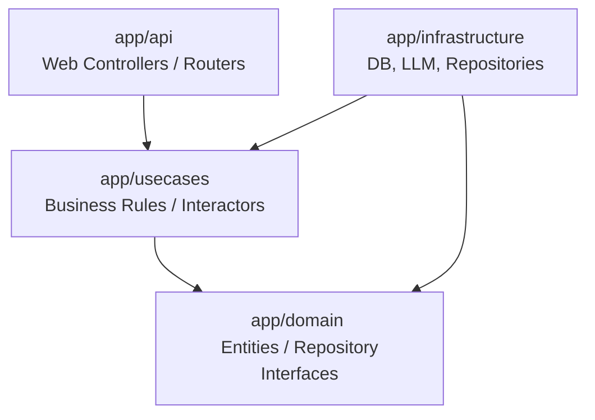

# AI Habit Companion & Learning Support App
（AI習慣化＆学習継続支援システム）

本プロジェクトは、**「褒めて・叱って伸ばす」** をコンセプトにした、AIによる学習および習慣化支援アプリケーションです。
厳格で傲慢ながらも愛のある白狼の『大神様』や、包容力に溢れ優しく包み込んでくれるお姉さん『ミオ』といった個性豊かなAIキャラクターたちが、あなたの目標達成を全力でサポートします。

本アプリケーションは、拡張性と保守性を重視した**クリーンアーキテクチャ（Clean Architecture）** に準拠して設計されており、非常に美しいコードベースを持っています。

---

## 🌟 主な機能

### 1. AI 習慣トラッカー (Habit Tracker)
* **チャレンジ作成**: 習慣化したいアクション（例：「毎日30分プログラミング」）と期間（1〜14日間）を自由に設定して、習慣化チャレンジを開始できます。
* **日々の記録とAIフィードバック**: チャレンジロードマップ上の各日をクリックし、「達成」または「サボり」を簡単に記録できます。記録するたびに、選択したAIキャラクターが直近の進捗状態や連続日数などを分析し、**「運勢」「魂の一言」「アドバイス」「具体的な次の一歩」**を即座にフィードバックします。
* **進捗統計**: 達成した日数、達成率（%）、現在の連続達成日数、全体の進捗率が美しい進捗バーと共にグラフでリアルタイムに可視化されます。

### 2. 学習継続支援おみくじ (Omikuji)
* **御神託（おみくじ）**: 連続修練（学習）日数や計画通りに進められたかどうかの状態、そして「今の一言（愚痴、困り事、今の気持ち）」を入力してボタンを押すと、キャラクターから心に刺さる御神託（おみくじ形式のフィードバック）を受け取ることができます。
* **履歴と継続分析**: 過去のやり取りをデータベースに記憶し、AIコーチがこれまでのユーザーの学習傾向（サボりがち、継続できている等）を踏まえた的確なアドバイスを行います。

### 3. AI キャラクター＆プロンプトのWebカスタマイズ
* **キャラクター切り替え**: メイン画面からいつでもコーチングを受けるキャラクターを切り替えることができます。
* **プロンプトとアバターのリアルタイム編集**: 管理画面（モーダル）から、キャラクターの「表示名」や「システムプロンプト」を直接編集できます。アバター画像のアップロードもサポートしており、**Cropper.jsによる直感的なトリミング・切り抜き機能**も内蔵しています。

### 4. 堅牢なフォールバック設計（オフライン対応）
* LLM APIへの接続失敗時やパースエラーの発生時には、キャラクターの個性に合わせた**高品質なルールベースのテキスト応答テンプレートに自動かつシームレスにフォールバック**します。これにより、APIキーが無い状態やオフライン環境であっても、アプリケーションを安定して動作させることができます。

---

## 🏗️ システムアーキテクチャ

本アプリケーションは、**クリーンアーキテクチャ**の概念に基づき、以下のようにレイヤーが明確に分離されています。



### ディレクトリ構成と役割
* `app/domain`
  * `entities/`: ビジネスロジックの中核となるデータ構造（`tracker.py`, `learning_support.py`）。外部依存を一切持ちません。
  * `repositories/`: データベース等へのアクセスを抽象化するインターフェース定義。
* `app/usecases`
  * ビジネスルールを実行し、ドメインとインフラを繋ぐユースケース層（`tracker_usecase.py`, `learning_support_usecase.py`）。
* `app/infrastructure`
  * `database/`: SQLAlchemyを使用したデータベース構成。習慣トラッカー用の `habit_tracker.db` と、学習支援用の `learning_support.db` による**マルチデータベース構成**を採用しています。
  * `repositories/`: ドメイン層で定義されたリポジトリインターフェースの具現化（SQLiteデータベースに対する操作）。
  * `ai/`: AIフィードバックを生成するサービスの具現化。LLM API呼び出しとルールベースへのフォールバックを統括します。
  * `llm_client.py`: APIクライアント。指数バックオフによるレートリミット時の自動リトライ処理を内蔵しています。
* `app/api`
  * FastAPIのルーター定義。入力値のバリデーション（DTO）やテンプレートのレンダリングを行います。
* `app/core`
  * アプリケーション設定（`config.py`）や、初期システムプロンプト定義（`prompts.py`）などのコアな共通設定を保持します。
* `templates/` & `static/`
  * フロントエンド資産。Tailwind CSSを用いたダークテーマ基調の美しいグラスモフィズム（Glassmorphism）デザインを採用。

---

## 🛠️ 技術スタック

* **Backend**: Python 3, FastAPI, Uvicorn, SQLAlchemy
* **Frontend**: HTML5, Vanilla JavaScript, CSS (TailwindCSS CDN & Custom Glassmorphism Styles), Cropper.js (アバター画像切り抜き)
* **Database**: SQLite (SQLAlchemyによるORM接続)
* **LLM**: Gemini-1.5-Flash (OpenAI互換APIエンドポイント経由での接続)

---

## 🚀 セットアップと起動方法

### 1. 環境変数の設定
プロジェクトのルートディレクトリに `.env` ファイルを作成し、以下のように必要な設定を記述します。
（Gemini APIを利用する場合、APIキーを指定してください。ローカルのLLMを使用する場合は、`LLM_API_BASE` などをそれに合わせて書き換えます。）

```env
# LLM 接続設定
LLM_API_BASE=https://generativelanguage.googleapis.com/v1beta/openai/
LLM_MODEL_NAME=gemini-1.5-flash
GEMINI_API_KEY=あなたのGemini_APIキー

# アプリケーション設定
APP_TITLE="習慣トラッカー"
APP_VERSION=1.0.0
CORS_ORIGINS=["*"]
```

### 2. 依存パッケージのインストール
仮想環境などを有効化した上で、`requirements.txt` からライブラリをインストールします。

```bash
pip install -r requirements.txt
```

### 3. アプリケーションの起動
エントリーポイントである `main.py` を実行します。

```bash
python main.py
```

Uvicornサーバーが起動し、デフォルトでは `http://127.0.0.1:8000` でサーバーが待機状態になります。

### 4. アプリケーションへのアクセス
* **AI 習慣トラッカー画面**: [http://127.0.0.1:8000/](http://127.0.0.1:8000/)
* **学習継続支援おみくじ画面**: [http://127.0.0.1:8000/omikuji-ui](http://127.0.0.1:8000/omikuji-ui)
* **API ドキュメント (Swagger UI)**: [http://127.0.0.1:8000/docs](http://127.0.0.1:8000/docs)
